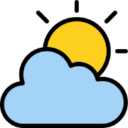

<div align="center">
  
  <h1>Weather App</h1>
  <em>Weather App in React & Tailwind CSS by <b>Atharv varshney</b>.</em><br/>
  <h4><a href="https://weather-app-atharv.netlify.app/" target="_blank">« Check Demo »</a></h4>
</div>

## Getting Started

Follow the below steps to get the project working.

1. Install the dependencies:

   ```sh
   # Using NPM
   npm install

   # Using Yarn
   yarn
   ```

2. Run using:

   ```sh
   # Using NPM
   npm start

   # Using Yarn
   yarn start
   ```

## ⚡ Features List

1. Data fetching from [OpenWeatherMap API](https://openweathermap.org/api)
2. Custom UI - Tailwind CSS
3. Single Page Application
4. Redux State Management

## 🗃 Tech Stack

<div align="center">
  <table>
    <thead>
      <td><strong>Technology</strong></td>
      <td><strong>Purpose</strong></td>
    </thead>
    <tbody>
      <tr>
        <td>React JS</td>
        <td>Frontend</td>
      </tr>
      <tr>
        <td>Redux</td>
        <td>State Management</td>
      </tr>
      <tr>
        <td>Tailwind CSS</td>
        <td>UI Components</td>
      </tr>
    </tbody>
  </table>
</div>
